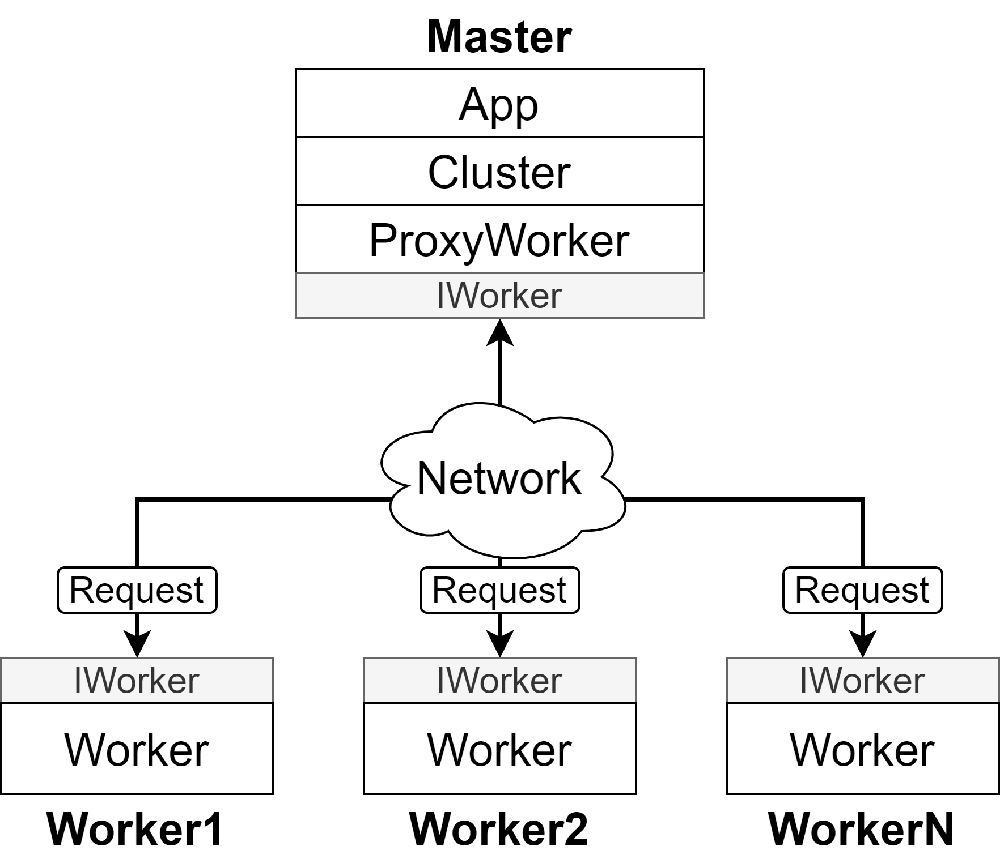

# Distributed DL Training Framework

## Information
@author: Trung Phan \
@email: trungphansg@gmail.com \
@created date: 2021-06-28 \
@last modified date: 2021-08-22\
@version: 2.2
@note:

## What is new?
* From version 1.0:
    * Instead of just sending one request on one connection, we can now send multiple requests on one connection.
* From version 1.1:
    * Using the compress pickle package with compression="lzma"
* From version 1.2:
    * Using the pickle package with zlib package for compression    
* From version 2.0:
    * Sending code to workers and running code remotely
    * Adding asynchronous distributed training capabilities 
    * Renaming: 
        * Workers -> Cluster
        * RPC -> ProxyWorker
        * rpcs -> workers
        * rpc -> worker
* From version 2.1:
    * Modifying the method Cluster.run_method()    
* From version 2.2:    
    * Adding the config.py file
    * Perfecting the framework
    

## Installation
* python3.7+ 
* pip install numpy pympler tensorflow pyyaml

* Master node:
    - worker.py
    - request.py
    - tools.py
    - transport.py
* Worker nodes:
    - config.py
    - rpc.py
    - proxyworker.py
    - app.py
    - task-*.py
    
## Architecture

## Files
* worker: runs on worker nodes
* config, proxy, master, app, tasks: runs on the master nodes

## Configuration
* Open file config.py:
    * hosts: list of worker nodes
    * ports: list of worker nodes' ports

## Running
* cd ddl 
* start N (N is the number of workers): starting the system
* python3.8 task-*: running a task
* shutdown: shutting down the system

## Testing
* start-cluster.py
* task-*.py

## References
https://stackabuse.com/python-async-await-tutorial \
https://docs.python.org/3/library/asyncio-task.html#running-tasks-concurrently \
https://docs.python.org/3/library/asyncio-stream.html \
https://stackoverflow.com/questions/62383366/asyncio-streamwriter-sending-multiple-writes

pip install pyyaml